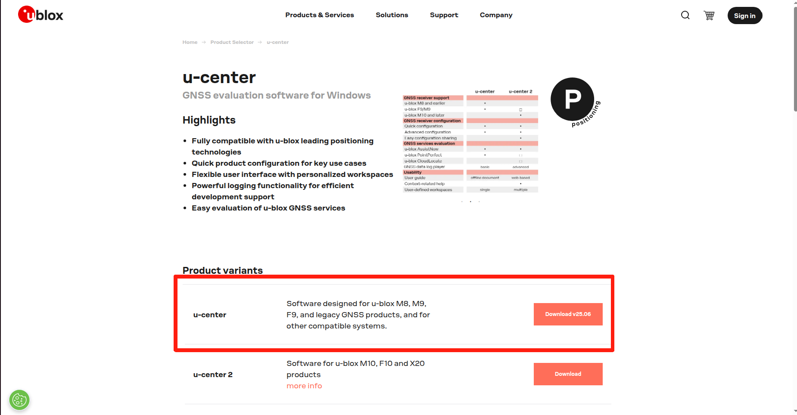

# 1. Overview
This document provides step-by-step instructions on how to integrate the **u-blox F9P** with both **Windows** and **ROS2** environments.

# 2. Windows
RTK (Real-Time Kinematic) localization consists of two components: **GPS-based localization** and **NTRIP correction**.  This section provides a detailed guide on how to achieve RTK localization in the Windows environment.

## 2.1 Download U-center
1. Please, use the following link to download the u-center  
   https://www.u-blox.com/en/product/u-center  
2. On the webpage, select **u-center** (highlighted in the red box), **not u-center 2**, as shown in _Figure 1_.

<p align="center">
  
</p>

<p align="center"><i>Figure 1: U-center download</i></p>

## 2.2 Connect the GPS
**Steps:**
1. Click **Receiver → Connection** to select the serial port of the u-blox device, as shown in _Figure 2_ below.

<p align="center">
  
</p>

<p align="center"><i>Figure 2: Port selection</i></p>

2. Then, set the **baud rate** for the serial communication.

<p align="center">
  
</p>

<p align="center"><i>Figure 3: Baudrate setting</i></p>

3.  Make sure the **connection icon** is flashing in the bottom status bar. This indicates that the serial communication between the computer and the GNSS device is functioning properly.

<p align="center">
  
</p>

<p align="center"><i>Figure 4: Port connection check</i></p>

## 2.3 Verification the GPS connection and situation
The GPS testing should be conducted in an open outdoor environment.  
When the **Fix Mode** indicator on the right side of the interface shows **3D (green)**, it means that the GNSS receiver is operating normally, as shown in _Figure 5_.

<p align="center">
  
</p>

<p align="center"><i>Figure 5: Pure GPS fix mode</i></p>

## 2.4 Connect the NTRIP Client
**Steps:**
1. Make sure your PC is connected to the Internet. Using a **personal hotspot** is recommended because NTRIP access may sometimes be blocked by the firewall.
2. Click **Receiver → NTRIP Client**, then enter your **host**, **port**, **username**, and **password**, as shown in _Figure 6_.
3. Click **Update Source Table** to search for available mount points, then select your desired mount point. Based on our previous tests, **RTK_SiReNT_32** provides accurate localization results.

<p align="center">
  
</p>

<p align="center"><i>Figure 6: Ntrip access</i></p>

4. If the connection is successful, the ntrip connection icon will be green in the bottom status bar as Figure 7.

<p align="center">
  
</p>

<p align="center"><i>Figure 7: Ntrip connection check</i></p>

## 2.5 Check the RTK status
The RTK status should be tested in an open outdoor environment.  
The current RTK status is displayed at the end of the **Fix Mode** field, as shown in the figures below.  
When **“Float”** appears (see _Figure 8_left_ ), it indicates that the RTK status is _float_; when **“Fix”** appears (see _Figure 8_right_), it indicates that the RTK status is _fixed_.

<p align="center">
  
</p>

<p align="center"><i>Figure 8: RTK Fix and Float solutions</i></p>

In addition, _Figure 8_ presents our RTK status test results obtained using the **Xsens MTi-680G**. Please refer to it as an example. The **green points** indicate _RTK fixed_ status, the **orange points** indicate _RTK float_ status, and the **red points** indicate _RTK invalid_ status.

<p align="center">
  
</p>

<p align="center"><i>Figure 9: Xsens result on Google Earth</i></p>

## 2.6 Insert the google map
Meanwhile, **u-center** can display the RTK localization results on **Google Maps** in real time, as shown in _Figure 10_.

<p align="center">
  
</p>

<p align="center"><i>Figure 10: Integrate with Google Map</i></p>

**Prerequisites**
1. Register for a **Google Maps Static API key** using:  
   https://developers.google.com/maps/documentation/static-maps/?hl=en  

**Steps:**
1. Enter your **Google Maps Static API key** under **Tool → Preferences → Access Tokens**, then click **Apply**, followed by **OK**, as shown in _Figure 11_.

<p align="center">
  
</p>

<p align="center"><i>Figure 11: API setting</i></p>

2. Open the "Map View".

<p align="center">
  
</p>

<p align="center"><i>Figure 12: Open the Google Map in u-center</i></p>

# 3. ROS2

## 3.1 Pre-setting on U-center WINDOWS
The **pre-configuration** in **u-center** consists of two parts: **serial communication settings** and **output message settings**.

##### Serial communication setting
**Steps:**
1. Configure the port under **Menu Bar → View → Message View → UBX → CFG → PRT (Ports)**, as shown in _Figure 13.

<p align="center">
  
</p>

<p align="center"><i>Figure 13: Port setting</i></p>

2. Set the output frequency under **Menu Bar → View → Message View → UBX → CFG → RATE (Rates)**, as shown in _Figure 14_.

<p align="center">
  
</p>

<p align="center"><i>Figure 14: Port rates setting</i></p>

3. After completing the modifications, save the parameters under **Menu Bar → View → Message View → UBX → CFG → CFG (Configuration)**, as shown in _Figure 15_.

<p align="center">
  
</p>

<p align="center"><i>Figure 15: Save config</i></p>

##### Output messages setting
**Steps:**
1. Configure the receiver to output raw data and navigation messages as follows:
	- Go to **Menu Bar → View → Message View → UBX → RXM (Receiver Manager) → RAWX (Multi-GNSS Raw Measurement Data)**, as shown in _Figure 16_. After enabling it, **RAWX** may not appear highlighted — this does not matter.
	- Go to **Menu Bar → View → Message View → UBX → RXM (Receiver Manager) → SFRBX (Subframe Data NG)**, as shown in _Figure 16_.
	- Go to **Menu Bar → View → Message View → UBX → RXM (Receiver Manager) → RTCM (RTCM Input Status)**, as shown in _Figure 16_.

<p align="center">
  
</p>

<p align="center"><i>Figure 16: Output RAWX, RTCM, and SFRBX</i></p>

2. Configure the receiver to output navigation results in **UBX** format:
	- Go to **Menu Bar → View → Message View → UBX → NAV → PVT**, as shown in _Figure 17_.
	- Right-click it and select **Enable**.

<p align="center">
  
</p>

<p align="center"><i>Figure 17: Output the PVT</i></p>

3. Configure the receiver to output **NMEA protocol** messages:
	- Go to **Menu Bar → View → Message View → NMEA**.
	- Enable the NMEA messages shown in _Figure 18_.

<p align="center">
  
</p>

<p align="center"><i>Figure 18: NMEA output setting</i></p>

4. After completing the modifications, save the parameters under **Menu Bar → View → Message View → UBX → CFG → CFG (Configuration)**, as shown in _Figure 19_.

<p align="center">
  
</p>

<p align="center"><i>Figure 19: Save config</i></p>

## 3.2 Connect Ubuntu with ublox F9P

##### 3.2.1 Update your ros2
To manage dependencies in **ROS 2**, update your package list and install **ros-dev-tools**, which includes **rosdep** and other useful development tools for ROS 2.
```bash
sudo apt update && sudo apt install ros-dev-tools
```
##### 3.2.2 Find your RTK receiver on your PC
1. Connect the receiver to your PC via a **USB port**.
2. The receiver should be automatically detected. To verify this, open a **Terminal** and run the following command. You should see **/dev/ttyACM0** (or a similar device, e.g., **/dev/ttyACM1**) displayed, as shown in _Figure 20_.
```bash
ls /dev/ttyACM*
```

<p align="center">  </p> <p align="center"><i>Figure 20: Port name</i></p>
3. To check the GPS stream, run the command in the **Terminal**, as shown in _Figure 21_.  This command displays the raw GPS data streaming from the receiver. Press **Ctrl + C** to stop the process.

```bash
sudo cat /dev/ttyACM0
```

<p align="center">  </p> <p align="center"><i>Figure 21: Info in the port</i></p>
 **Tip:** If you don’t see any output or the device is missing, make sure your user has the appropriate permissions (e.g., is a member of the **dialout** group).  
You can check your group memberships by running the following command:
```bash
groups
```


If you do not have the dialout group, you can add yourself with the command below. Afterward, log out and log back in for the changes to take effect.
 ```bash
 sudo usermod -a -G dialout $USER #add the dialout group
 sudo reboot # restart your pc
 ```


## 3.3 Ublox Driver
##### 3.3.1 Build Ublox Driver
1. To create a **workspace directory**, open a **Terminal** and make a new folder (for example, **ros2_ws**) with a **src** subfolder:
```bash
mkdir -p ~/ros2_ws/src
```

2. Navigate to your workspace/src.
```bash
cd ~/ros2_ws/src
```

3. To clone the u-blox repository to your ROS 2 workspace
```bash
git clone --branch ros2 https://github.com/KumarRobotics/ublox.git
```

4. Initiate **rosdep** and download the latest package dependency definitions.
```bash
sudo rosdep init
rosdep update
```

5. To build u-blox Node, return to the main workspace folder and compile:
```bash
cd ~/ros2_ws
rosdep install --from-paths src --ignore-src -r -y
colcon build
source install/setup.bash
```

6. Now the u-blox Node is available in your ROS2 environment.
7. Modify the configuration file to update device paths or parameters as needed (we will use **/dev/ttyACM0** ). The ublox_gps package includes a default configuration file named **zed_f9p.yaml**. Open the configuration file by command and modify the "device" as Figure 22:
```bash
nano ~/ros2_ws/src/ublox/ublox_gps/config/zed_f9p.yaml
```


<p align="center">  </p> <p align="center"><i>Figure 22: Modify yaml setting</i></p>

8. To configure the node with the **zed_f9p.yaml** settings, update the launch file as Figure 23. Open the file and add the following line to load the configuration:
```bash
nano ~/ros2_ws/src/ublox/ublox_gps/launch/ublox_gps_node-launch.py
```
<p align="center">  </p> <p align="center"><i>Figure 23: Modify the launch file</i></p> 
9. Rebuild the packages. 
```bash
cd ~/ros2_ws
colcon build
```

##### 3.3.2 Test the GPS
```bash
source install/setup.bash
ros2 launch ublox_gps ublox_gps_node-launch.py
```
If everything is configured correctly, the node should begin publishing GPS data from the ttyACM0 receiver as Figure 24.
<p align="center">  </p> <p align="center"><i>Figure 24: Launch the ublox driver</i></p> 


##### 3.3.3 topics and service list
1. Run the following command to view available Topics as Figure 25. 
```bash
ros2 topic list
```


<p align="center">  </p> <p align="center"><i>Figure 25: Topic list</i></p>

2. View the list of available services provided by the Node as Figure 26.
```bash
ros2 service list
```


<p align="center">  </p> <p align="center"><i>Figure 26: Service list</i></p>

## 3.4 NTRIP Client
##### 3.4.1 Build NTRIP Client
1. Navigate to ROS2 workspace directory and clone the ROS 2 branch
```bash
cd ~/ros2_ws/src
git clone --branch ros2 https://github.com/LORD-MicroStrain/ntrip_client.git
```
2. Return to the workspace root, install any missing dependencies, and build the package
```bash
cd ~/ros2_ws
rosdep install --from-paths src --ignore-src -r -y
colcon build
```
3. Update NTRIP parameters such as host, port, username, password, and mountpoint and save the changes in file as Figure 26.
```bash
nano ~/ros2_ws/src/ntrip_client/launch/ntrip_client_launch.py
```

<p align="center">  </p> <p align="center"><i>Figure 27: Login Ntrip</i></p> 
4. Rebuild
```markup
cd ~/ros2_ws
colcon build
```

##### 3.4.2 Test NTRIP Client
1. Launch the Node with your NTRIP parameters to establish a connection to the NTRIP Caster as Figure 28:
```bash
ros2 launch ntrip_client ntrip_client_launch.py
```

<p align="center">  </p> <p align="center"><i>Figure 28: Launch Ntrip</i></p>

## 3.5 Test RTK
1. Check node connection
```bash
rqt_graph
```

<p align="center">  </p> <p align="center"><i>Figure 29: ROS graph</i></p>

2. Check services
If the ntrip and ublox driver run successfully, the services in Figure 30 should be included, when run command.
```bash
ros2 service list
```

<p align="center">  </p> <p align="center"><i>Figure 30: Services for RTK</i></p>


3. Check topics
The topics should like Figure 31

<p align="center">  </p> <p align="center"><i>Figure 31: Topics for RTK</i></p>

Open **three Terminals** in the workspace, and run `source install/setup.bash` in each of them.  Then, check the topics **/nmea**, **/rtcm**, and **/ublox_gps_node/navpvt** separately in the three Terminals.

There are a lot of data format in the nmea to represent the RTK status. 
```bash
ros2 topic echo /nmea 
```

```bash
ros2 topic echo /rtcm
```
The rtcm should have message


```bash
ros2 topic echo /ublox_gps_node/navpvt
```
The following list introduces the main params in the /ublox_gps_node/navpvt

| **Category** | **Field**                          | **Description / Meaning**           | **Unit / Scale** | **Typical Use**                                |
| ------------ | ---------------------------------- | ----------------------------------- | ---------------- | ---------------------------------------------- |
| **Time**     | `i_tow`                            | GPS time of week                    | ms               | Timestamp in GPS week                          |
|              | `year, month, day, hour, min, sec` | UTC date & time                     | —                | Human-readable time                            |
| **Position** | `lat`, `lon`                       | Latitude, longitude                 | deg × 1e-7       | `lat_deg = lat * 1e-7`, `lon_deg = lon * 1e-7` |
|              | `h_msl`                            | Altitude above mean sea level       | mm → m           | Recommended for altitude                       |
|              | `height`                           | Height above ellipsoid              | mm → m           | Used in geodesy (less intuitive)               |
| **Fix Info** | `fix_type`                         | Solution type (0–5)                 | —                | 0 = no fix, 3 = 3D, 4 = GNSS+DR                |
|              | `flags.bit0`                       | `GNSS_FIX_OK`                       | bool             | Fix valid                                      |
|              | `flags.bit1`                       | `DIFF_SOLN`                         | bool             | Differential corrections (SBAS/RTCM) used      |
|              | `flags.bits6–7`                    | `carrSoln` = carrier-phase solution | —                | 0 = none, 1 = RTK-FLOAT, 2 = RTK-FIX           |
|              | `num_sv`                           | Satellites used                     | count            | Higher = better geometry                       |
|              | `p_dop`                            | Position dilution of precision      | 0.01             | `PDOP = p_dop / 100`                           |


## 3.6 Current RTK localization results and issues

##### 3.6.1 Current RTK localization results
I conducted 18 tests, and the following two represent the best results. 

In the figures, the green points indicate RTK fixed status, the orange points indicate RTK float status, and the grey points indicate RTK invalid status.

Firstly, I tested a large loop.

<p align="center">  </p> <p align="center"><i>Figure 32: Large loop test</i></p>

Secondly, I tested a small loop.

<p align="center">  </p> <p align="center"><i>Figure 33: Small loop test</i></p>

###### 3.6.2 Current issues
1. The RTK localization may occasionally **fail** or **drift significantly**.
2. The **altitude** estimation may sometimes be **inaccurate**.

## 3.7 Possible Solution
1. I will try the **Wheeltech G60 RTK localization system** as an alternative.
2. I recommend using a **higher-quality RTK module**, as the current localization performance is insufficient for the task.