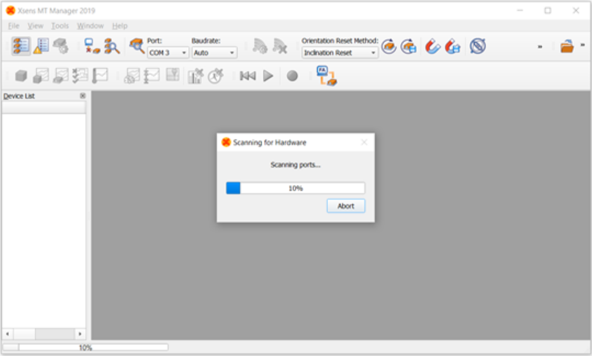
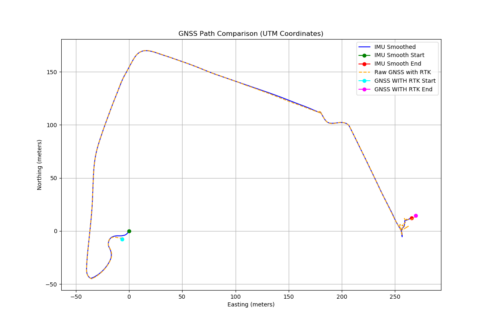
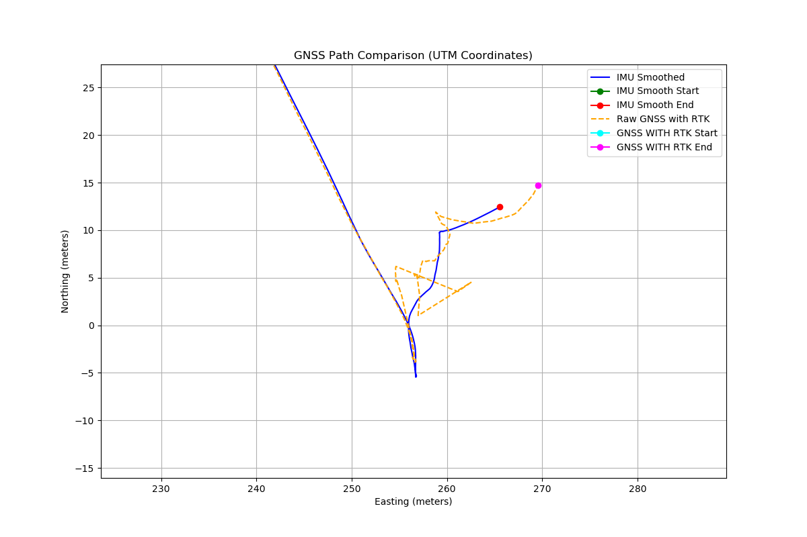
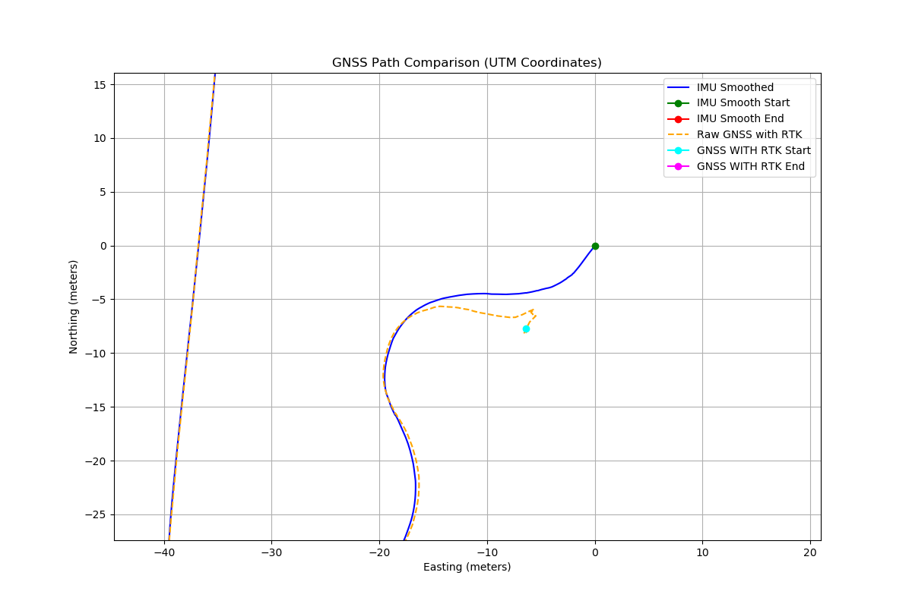

# software download
there are two ways adjusting and using xsens-mti-680g: the **MT manager** and the **ros driver**.
the official ros driver is valid in ros1 and ros2, but, in this instruction, only the ros1 will be used.
## MT manager install
refer to:
https://base.movella.com/s/article/MT-Manager-Installation-Guide-for-ubuntu-20-04-and-22-04?language=en_US

https://wiki.ros.org/xsens_mti_driver

1. Sofware Download
	1. Please download the MT Software Suite under the MTi Products section：[https://www.movella.com/support/software-documentation](https://www.movella.com/support/software-documentation
2. extract the software
```bash
sudo tar -xf MT_Software_Suite_linux-x64_2025.0_b20241121.1_r1732180523.tar.gz
sudo chmod -R o+rw MT_Software_Suite_linux-x64_2025.0/
cd MT_Software_Suite_linux-x64_2025.0
sudo tar -xf mtmanager_linux-x64_2025.0.tar.gz
sudo chmod -R o+rw mtmanager/
```
3. install the dependencies for MT Manager for ubuntu 20.04
Refer to the readme in the doc (located at mtmanager/linux-64/doc/MTM.README) to install dependencies for MT Manager.
```bash
sudo apt update
sudo apt install qt5-default
sudo apt-get update -y
sudo apt-get install -y libqt5opengl5
sudo apt-get install -y libusb-1.0-0
sudo apt-get install -y libxcb-xinerama0
sudo apt-get install -y libxcb-xinput0
sudo apt-get install -y libdouble-conversion1
```

libdouble-conversion.so.1
```bash
wget http://ftp.br.debian.org/debian/pool/main/d/double-conversion/libdouble-conversion1_3.1.0-3_amd64.deb
sudo chmod +x libdouble-conversion1_3.1.0-3_amd64.deb
sudo dpkg -i libdouble-conversion1_3.1.0-3_amd64.deb
```

libicu18n.so.60
Make sure you have the bionic-security source is in your /etc/apt/sources.list:
```bash
sudo gedit /etc/apt/sources.list
```
Add this to the last line if it is not present:
```bash
deb http://security.ubuntu.com/ubuntu bionic-security main
```
then run:  
```bash
sudo apt-get update
sudo apt-get install libicu60
```

run mtmanager
run your mtmanager (located at: mtmanager/linux-x64/bin/)
```bash
./mtmanager
```

## driver downloading
refer to 
https://github.com/xsenssupport/Xsens_MTi_ROS_Driver_and_Ntrip_Client/tree/main#

install dependency:

```
sudo apt install ros-[ROSDISTRIBUTION]-nmea-msgs
sudo apt install ros-[ROSDISTRIBUTION]-mavros-msgs
```

for example for ROS Noetic(use `rosversion -d` to get your version):

```
sudo apt install ros-noetic-nmea-msgs
sudo apt install ros-noetic-mavros-msgs
```

clone the source file to your `catkin_ws`, and run the code below:

```
cd ~/catkin_ws
catkin_make
```

Source the `/devel/setup.bash` file inside your catkin workspace

```
source ./devel/setup.bash
```

# set the GNSS

## access authority setting
!!! in your BIOS please shutdown your security protection, when using linux, as the protection will eject any installization for the custom core.

plugin the xsens-mti-680g to your pc, check whether the `ttyUSB0` is in your /dev by:
```bash
ls /dev
```
For the MTi-1/600/Sirius product series, such as 680g, where the FTDI chip was used, try the following steps:

```bash
sudo /sbin/modprobe ftdi_sio
echo 2639 0300 | sudo tee /sys/bus/usb-serial/drivers/ftdi_sio/new_id
```

Make sure you are in the correct group (often dialout or uucp) in order to access the device. You can test this with:

```bash
ls -l /dev/ttyUSB0
// the result likes this
crw-rw---- 1 root dialout 188, 0 May  6 16:21 /dev/ttyUSB0
```

your terminal should be in the correct group, the group for the xsens-mti-680g is dialout, as the `ls -l /dev/ttyUSB0` shows,

you can check the group by 

```bash
groups
```

if there is not a dialout, you can fix this in two ways:
1) Add yourself to the correct group. You can add yourself to it by using your distributions user management tool, or call:
```bash
sudo usermod -G dialout -a $USER
```

	Be sure to replace dialout with the actual group name if it is different. After adding yourself to the group, either relogin to your user, or add the current terminal session to the group:

```bash
newgrp dialout
```

2) Use udev rules. Alternatively, put the following rule into /etc/udev/rules.d/99-custom.rules:

```bash
sudo gedit /etc/udev/rules.d/99-custom.rules
# the 99-custom.rules needs to be created by yourself
```
	adding the following line in the `99-custom.rules`

```
SUBSYSTEM=="tty", ATTRS{idVendor}=="2639", ACTION=="add", GROUP="$GROUP", MODE="0660"
```
	Change $GROUP into your desired group (e.g. adm, plugdev, or usb).


then, after the group setting,  reboot your pc
```bash
sudo reboot
```
You can specify your own port and baud rate in the [`xsens_mti_node.yaml`](https://github.com/xsenssupport/Xsens_MTi_ROS_Driver_and_Ntrip_Client/blob/main/src/xsens_ros_mti_driver/param/xsens_mti_node.yaml) file:

```yaml
// change the scan_for_devices to `false` and uncomment/change the port name and baud rate to your own values (by default it is 115200, unless you have changed the value with MT Manager).
scan_for_devices: false # set to false w=otherwise the port will not work
port: '/dev/ttyUSB0'
# baudrate: 115200
```
## device setting by the MT manager or the driver
### device setting by MT Manager
- click the "single scanning" your MT Manager![[single_scanning.png]] 

- MT Manager - Device Settings - Output Configuration , select "UTC Time, Sample TimeFine, Status Word, Latitude and Longitude" and other required data, click "Apply",
### device setting by driver
- or your could change the `enable_deviceConfig` in [xsens_mti_node.yaml](https://github.com/xsenssupport/Xsens_MTi_ROS_Driver_and_Ntrip_Client/blob/main/src/xsens_ros_mti_driver/param/xsens_mti_node.yaml) to true and change the `pub_utctime`, `pub_gnss` to true, then change the other desired output parameters as listed in the [xsens_mti_node.yaml](https://github.com/xsenssupport/Xsens_MTi_ROS_Driver_and_Ntrip_Client/blob/main/src/xsens_ros_mti_driver/param/xsens_mti_node.yaml) for the complete sensor configurations.
- set `enable_filter_config` in  [xsens_mti_node.yaml](https://github.com/xsenssupport/Xsens_MTi_ROS_Driver_and_Ntrip_Client/blob/main/src/xsens_ros_mti_driver/param/xsens_mti_node.yaml) to `true`, which will refuse the IMU data in the sensor and the GNSS results to smooth the path.
- set `enable_beidou` in the [xsens_mti_node.yaml](https://github.com/xsenssupport/Xsens_MTi_ROS_Driver_and_Ntrip_Client/blob/main/src/xsens_ros_mti_driver/param/xsens_mti_node.yaml) to `true`, it you like
```yaml
# If set true: Enables Beidou, disables GLONASS
# If set false: Disables Beidou, enables GLONASS
# valid for MTi-7/8/670/680/710
```
## GNSS step and step testing

### by MT Manager
1. open the GNSS position draw window ![[position_drawing.png]]
### by the ros drive
1. open the  [xsens_mti_node.yaml](https://github.com/xsenssupport/Xsens_MTi_ROS_Driver_and_Ntrip_Client/blob/main/src/xsens_ros_mti_driver/param/xsens_mti_node.yaml), set the `enable_deviceConfig` to `true` to configure your sensor
2. `roslaunch xsens_mti_driver xsens_mti_node.launch` to activate the GNSS and configure your device
3. set the `enable_deviceConfig` to `false`
4. `roslaunch xsens_mti_driver xsens_mti_node.launch`, then `rostopic echo` the following topics

| topic                    | Message Type                        | Message Contents                                                                                                                                | Data Output Rate  <br>(Depending on Model and OutputConfigurations at MT Manager) |
| ------------------------ | ----------------------------------- | ----------------------------------------------------------------------------------------------------------------------------------------------- | --------------------------------------------------------------------------------- |
| filter/free_acceleration | geometry_msgs/<br>Vector3Stamped    | free acceleration from filter, which is the acceleration in the local earth coordinate system (L) from which  <br>the local gravity is deducted | 1-400Hz(MTi-600 and MTi-100 series), 1-100Hz(MTi-1 series)                        |
| filter/positionlla       | geometry_msgs/<br>Vector3Stamped    | filtered position output in latitude (x), longitude (y) and altitude (z) as Vector3, in WGS84 datum                                             | 1-400Hz(MTi-600 and MTi-100 series), 1-100Hz(MTi-1 series)                        |
| filter/quaternion        | geometry_msgs/<br>QuaternionStamped | quaternion from filter                                                                                                                          | 1-400Hz(MTi-600 and MTi-100 series), 1-100Hz(MTi-1 series)                        |
| gnss                     | sensor_msgs/<br>NavSatFix           | raw 4 Hz latitude, longitude, altitude and status data from GNSS receiver                                                                       | 4Hz                                                                               |
| gnss_pose                | geometry_msgs/<br>PoseStamped       | filtered position output in latitude (x), longitude (y) and altitude (z) as Vector3 in WGS84 datum, and quaternion from filter                  | 1-400Hz(MTi-600 and MTi-100 series), 1-100Hz(MTi-1 series)                        |

# set the RTK
after we get the GNSS position massages,  we need to let the Xsens mti 680g to receive the RTCM massages to correct the positioning error through the NTRIP server.

There are three methods to receive the RTCM massages through  the NTRIP server.
## NTRIP server on a PC with main connector/cable
![[NTRIP server on PC.png]]
### using the MT manager
1. ensure your laptop is connected with internet
2. open the NTRIP client which is under the MT manager tool bar
3. input the address and port of the NTRIP server you want to connected. For example, the address and port of the SiReNT is 199.184.151.36 and 2101.
4. input your NTRIP Account(username and password), you may need to pay one from the NTRIP company
5. select the closest NTRIP mount point in the dropdown menu
6. click the "update mount points"
7. click "Start"
8. open the `Status Data` view window, the `RTK Status` should be 1, that means RTK Fix like the figure shows, the `RTK status` should be stable at the 1 (High, RTK Fix), otherwise RTK is invalid![[ab8a08c89267b8dd2ae6f72ed2f754b5.jpg]]
9. if the RTK status is not fix, please change the mount points, until the RTK fix.
10. if changing the mount points does not work, there may be two reasons now:
	1. the antenna of the xsens mti 680g may not good enough
	2. weather or the geographical environment is not good
	3. the GNSS system is not good, switch to the Beidou, the default is GLONASS

The NTRIP Client window is divided into two sections:
1. Under NTRIP caster settings, the user can log-in to the desired NTRIP server by providing the address, port number, username and password.
2. The NTRIP stream section allows for further configuration of the NTRIP setup:
	1. The "Update mount points" button can be used to refresh the dropdown menu for NTRIP mount points.
	2. The "Mount point details" button will open a separate window with an overview of all available mount points for the configured provider (see figure below).
	3. The "GGA transmit interval" indicates the interval in seconds at which the current location of the MTi is transmitted to the NTRIP server. This is a requirement for obtaining RTCM messages.
	4. Alternatively, it is possible to manually set the position (latitude, longitude, altitude) that is transmitted to the NTRIP server, instead of transmitting the real-time position as estimated by the MTi.
	5. Finally, the "Start" button will initiate the NTRIP connection. An increasing number of bytes transmitted should be visible. The MT Status View (see Overview MT Manager) can now be used to check the RTK fix status.
### using the ros package
1. cd to the ntrip.launch under the ntrip package
2. fill the host, port, mountpoint, username, password
3. then cd to the workspace 
4. `source ./devel/setup.bash`
5. roslaunch the xsens_mti_node.launch and the ntrip.launch
	The Ntrip_client subscribes to the `/nmea` rostopic from `xsens_ros_mti_driver`, and wait until it gets GPGGA data from that rostopic for maximum 300 sec, it will send GPGGA to the Ntrip Caster(Server) every 1 seconds(defined by [ntrip.launch](https://github.com/xsenssupport/Xsens_MTi_ROS_Driver_and_Ntrip_Client/blob/main/src/ntrip/launch/ntrip.launch)).
6. `rostopic echo` the following topics: 
```
/filter/positionlla
/gnss
/gnss_pose
/nmea 
/rtcm 
/status 
```
you could check `rostopic echo /rtcm`, there should be HEX RTCM data coming, or `rostopic echo /status` to check the RTK Fix type, it should be 1(RTK Floating) or 2(RTK Fix). In the `/status`, the `rtk_status` should be stable at 2.
After the [ntrip.launch](https://github.com/xsenssupport/Xsens_MTi_ROS_Driver_and_Ntrip_Client/blob/main/src/ntrip/launch/ntrip.launch) is activated. the position_covariance in the /gnss should decrease obviously in comparison with result of  `xsens_mti_node.launch`. 


# RTK testing experiment in NUS
1. ensure wifi is stable
2. in MT Manager, test the following mount points, and check the RTK status in the Status Date window.
	- [x] DGNSS_SNUS -> RTK_Status
	- [ ] RTK_SNUS_31 -> RTK_Status
	- [ ] RTK_SNUS_32 -> RTK_Status
	- [ ] RTK_SNUS_GPS -> RTK_Status can keep in RTK Fix status in relatively long time as well
	- [ ] RTK_SiReNT_32 -> RTK_Status can keep in the RTK Fix status within the longest time
	- [ ] RTK_SiReNT_31 -> RTK_Status

3. open the position monitor to check whether the RTCM works
4. set the mountpoint in the ntrip/launch/ntrip.launch to the stable server tested by the MT Manager.
5. launch the xsens_mti_node.launch only and record the /gnss, /gnss_pose, /filter/positionlla
6. launch the ntrip.launch record the /gnss, /gnss_pose, /filter/positionlla, /nmea, /rtcm, /status
## current result
<div style="display: flex; justify-content: space-between;">
  
  
</div>

%% 2. open the xsens_mti_node.yaml, set the "enable_device_Config" to true.
7. roslaunch the xsens_mti_node.launch and the ntrip.launch.
8. set the enable_device_Config to false %%

## NTRIP modem and a wireless connection

## base station and wireless connection


# Do the localisation by xsens mti 680g

keep you params setting for the ntrip and xsens mti 680g

open two terminals:

```
roslaunch xsens_mti_driver xsens_mti_node.launch
```

or with the 3D display rviz:

```
roslaunch xsens_mti_driver display.launch
```

and then

```
roslaunch ntrip ntrip.launch
```


